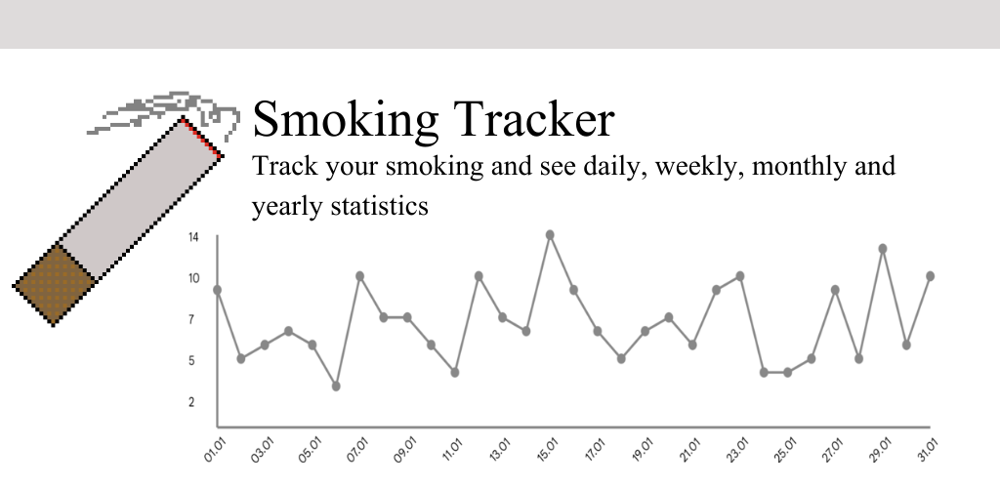
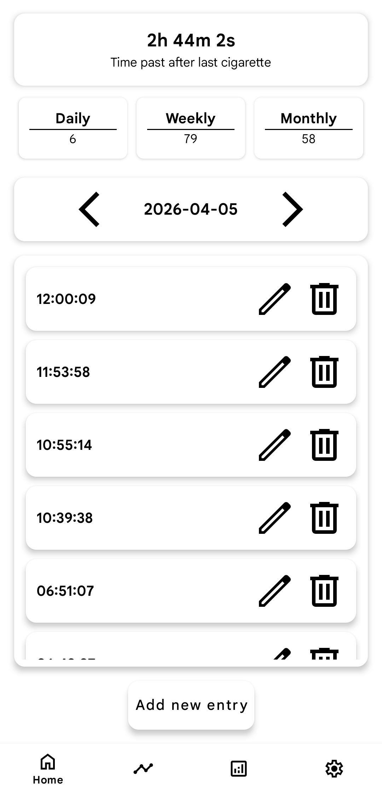
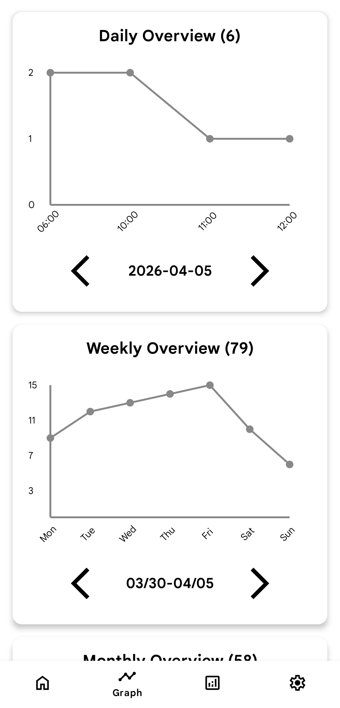
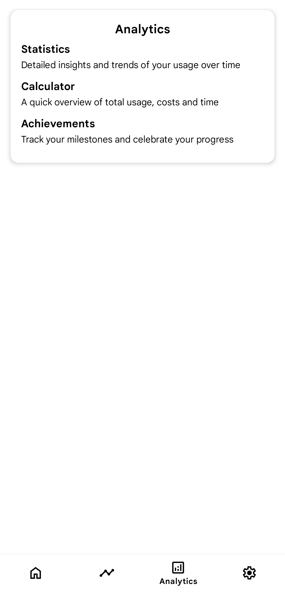
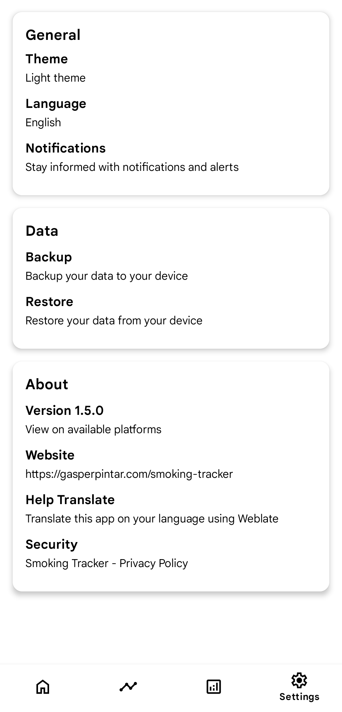
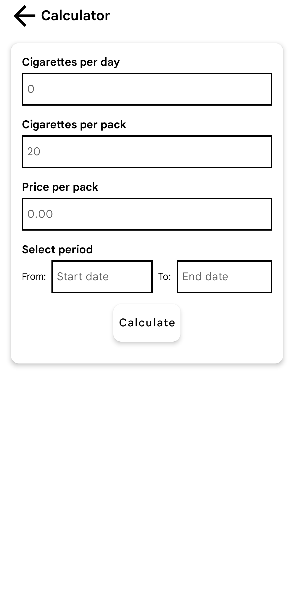
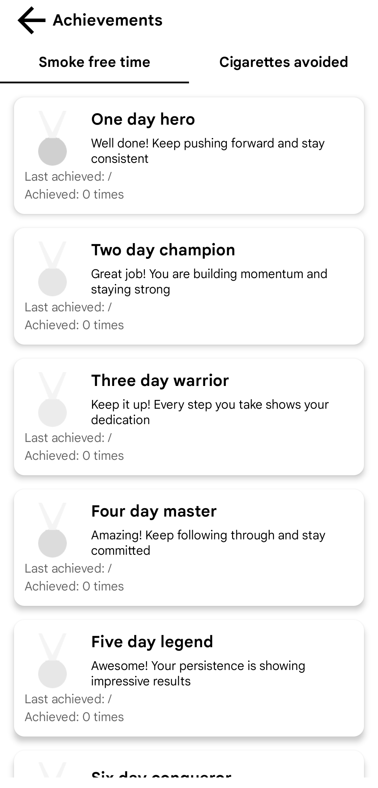
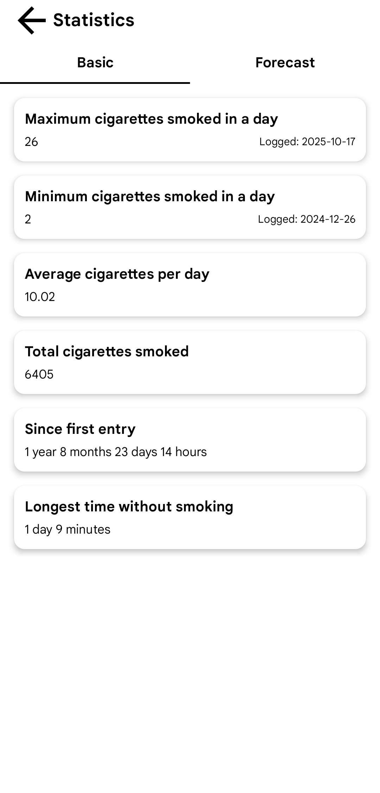
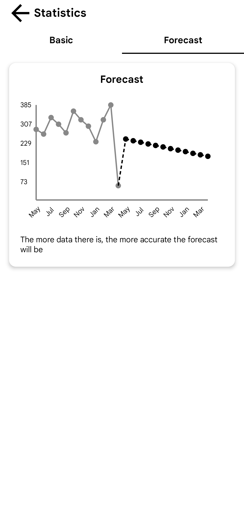

<div align="center">


<br>
<h1>Smoking Tracker</h1>

<p align="center">
  <strong>English</strong> | <a href="README.sl.md">Slovenščina</a> 
</p>

</div>

<div align="center">

Created by [Gašper Pintar](https://gasperpintar.com)

[](https://gasperpintar.com/smoking-tracker)

<div style="display:flex; justify-content:center; align-items:center; gap:2px;">
  <a href="https://github.com/pintargasper/SmokingTracker/releases/latest" target="_blank">
    
  </a>

  <a href="https://f-droid.org/en/packages/com.gasperpintar.smokingtracker/" target="_blank">
    
  </a>

  <a href="https://apt.izzysoft.de/fdroid/index/apk/com.gasperpintar.smokingtracker" target="_blank">
    
  </a>

  <a href="https://www.openapk.net/smoking-tracker/com.gasperpintar.smokingtracker/" target="_blank">
    
  </a>

  <a href="https://play.google.com/store/apps/details?id=com.gasperpintar.smokingtracker" target="_blank">
    
  </a>
</div>

[](https://apilevels.com)
[](https://github.com/pintargasper/SmokingTracker/releases) 
[](https://github.com/pintargasper/SmokingTracker/releases)
[](https://translate.gasperpintar.com/engage/smokingtracker/?utm_source=widget)

</div>

Available on other platforms
 - [Android Freeware](https://www.androidfreeware.net/download-smoking-tracker-apk.html)

## Table of Contents
- [About](#-about)
- [Supported Languages](#-supported-languages)
- [Help Translate](#-help-translate)
- [Dependencies & Versions](#-dependencies--versions)
- [Building instructions](#-building-instructions)

## 🚀 About
**Smoking Tracker** is an easy to use smoking tracking app that helps you understand your habits and progress towards quitting. Every cigarette you smoke is clearly recorded, giving you detailed insight into your daily, weekly and monthly patterns

**Key Features**
- **Local data storage** for greater privacy
- **Daily, monthly and yearly** statistics with graphs
-  **Simple analytics** to help you understand your habits
- **Automatic backups** (depending on device)
- **Multi language support**: English and Slovenian
- **Simple and intuitive** user interface

<details>
  <summary>View application images</summary>

  <div style="display: flex; gap: 12px; justify-content: center; align-items: flex-start; flex-wrap: wrap;">
    
    
    
    
    
    
    
    
    
  </div>
</details>

## 🌐 Supported Languages

| Language       | Translated |
|:---------------|:-----------|
| 🇺🇸 English    | [](https://translate.gasperpintar.com/projects/smokingtracker/app/en) |
| 🇸🇮 Slovenian  | [](https://translate.gasperpintar.com/projects/smokingtracker/app/sl) |
| 🇺🇦 Ukrainian | [](https://translate.gasperpintar.com/projects/smokingtracker/app/uk) |

> Additional languages will be added in future releases

## 🌐 Help translate

<div align="center">
  <a href="https://translate.gasperpintar.com/engage/smokingtracker/?utm_source=widget" target="_blank">
    
  </a>
</div>

## 📝 Dependencies & Versions

**Gradle Plugin**
- Android Gradle Plugin: 9.1.0

**Libraries**
> All libraries are configured in [`libs.versions.toml`](gradle/libs.versions.toml)

## 📝 Building Instructions

### Steps

1. **Clone the repository**
```shell
git clone https://github.com/pintargasper/SmokingTracker.git
cd SmokingTracker
```

2. **Open the project in Android Studio**
- Choose **Import Project (Gradle)** and wait for the project to sync
- Make sure you have the correct **JDK** and **Android SDK** version set up

3. **Build the APK or run the app**
- For a debug build
```shell
./gradlew assembleDebug
```
- For a release build
```shell
./gradlew assembleRelease
```

4. **Run on emulator or device**
- In Android Studio, select an emulator or connect a physical device and click **Run**
