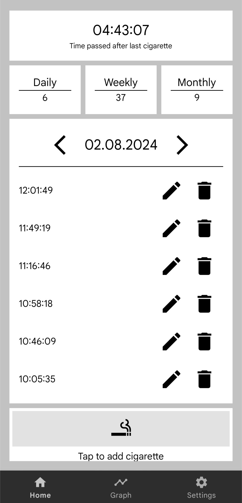
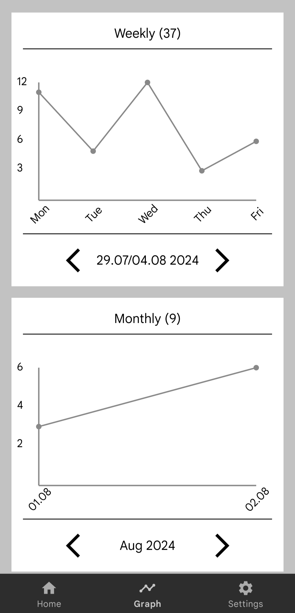

# Smoking tracker
Smoking tracker is a program that allows the user to easily track the number of cigarettes smoked. It also enables the display of data on weekly, monthly and yearly graphs

## Supported languages
- Slovenian
- English
- German
- French

## App preview

<table class="responsive-table" align="center">
  <tr>
    <td style="text-align: center; padding: 10px;">
      
       
      Home page
    </td>
    <td style="text-align: center; padding: 10px;">
      
       
      Graph page
    </td>
    <td style="text-align: center; padding: 10px;">
      
       
      Settings page
    </td>
  </tr>
</table>