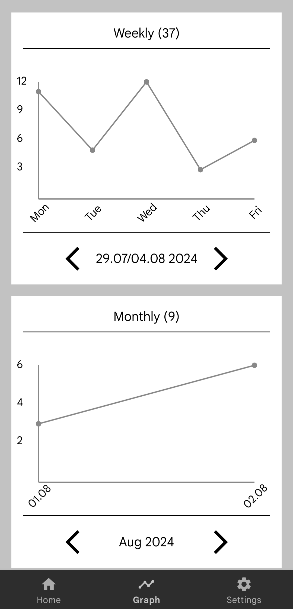
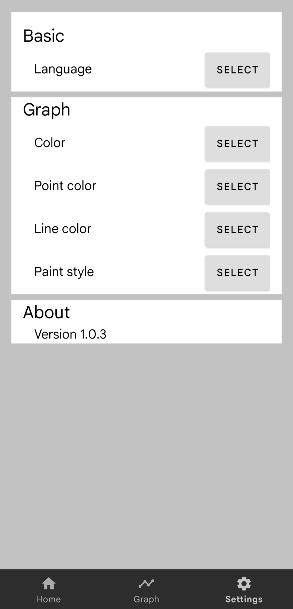

# Smoking tracker
Smoking tracker is a program that allows the user to easily track the number of cigarettes smoked. It also enables the display of data on weekly, monthly and yearly graphs

## Supported languages
- Slovenian
- English
- German
- French

## App preview
- The screenshots show parts of the app namely…
  - Home page
  - Graph page
  - Settings page

  
  
  

