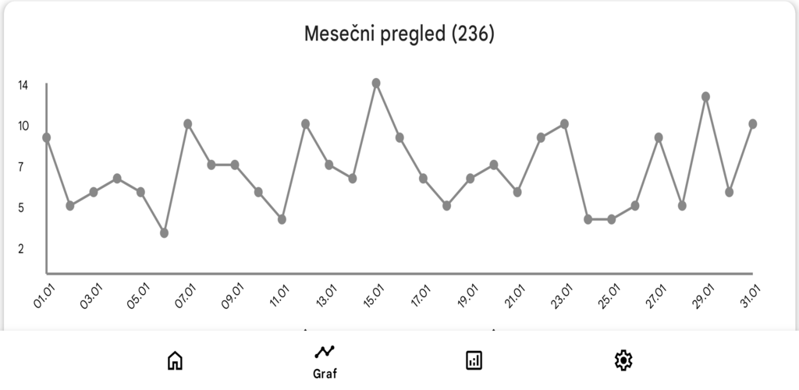
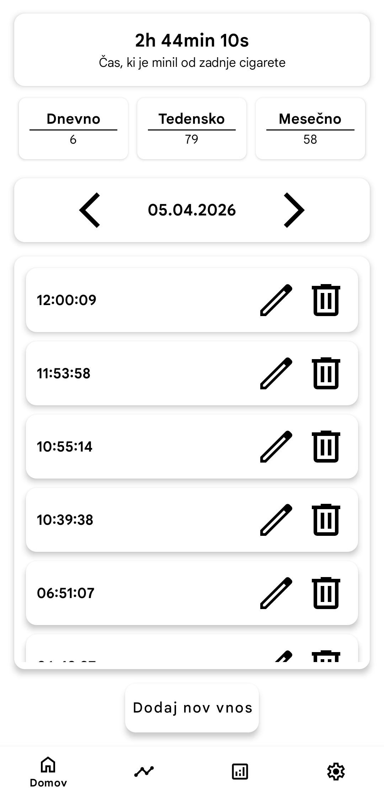
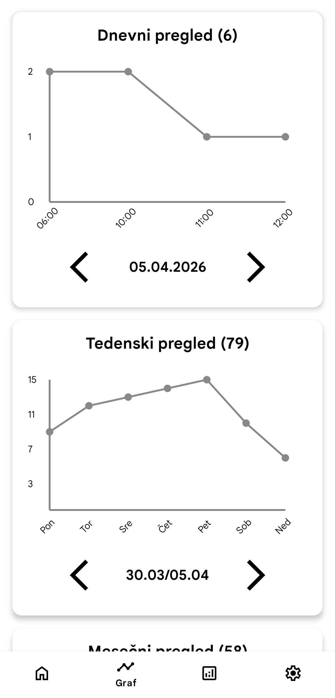
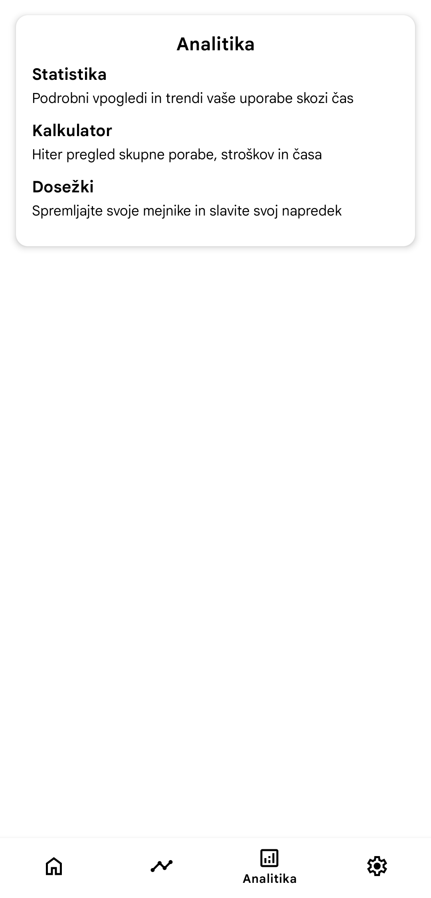
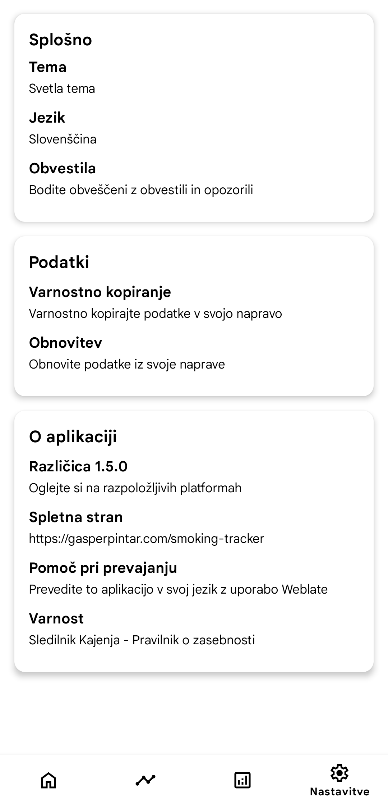
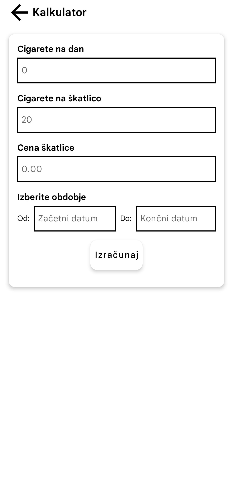
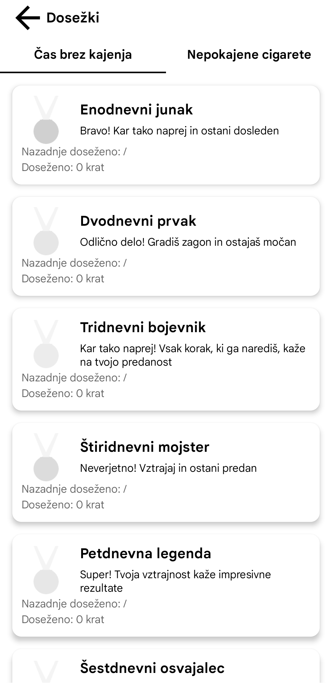
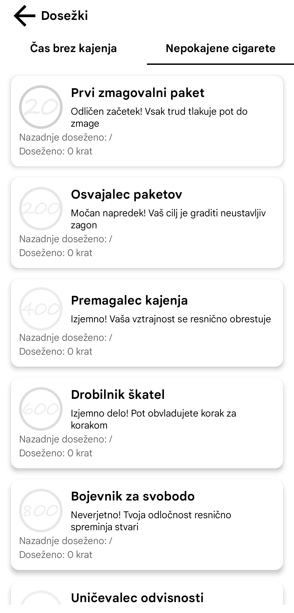

<div align="center">


<br>
<h1>Sledilnik Kajenja</h1>

<p align="center">
  <a href="README.md">English</a> | <strong>Slovenščina</strong> 
</p>

</div>

<div align="center">

Ustvaril [Gašper Pintar](https://gasperpintar.com)

[](https://gasperpintar.com/smoking-tracker)

<div style="display:flex; justify-content:center; align-items:center; gap:2px;">
  <a href="https://github.com/pintargasper/SmokingTracker/releases/latest" target="_blank">
    
  </a>

  <a href="https://f-droid.org/en/packages/com.gasperpintar.smokingtracker/" target="_blank">
    
  </a>

  <a href="https://apt.izzysoft.de/fdroid/index/apk/com.gasperpintar.smokingtracker" target="_blank">
    
  </a>

  <a href="https://www.openapk.net/smoking-tracker/com.gasperpintar.smokingtracker/" target="_blank">
    
  </a>

  <a href="https://play.google.com/store/apps/details?id=com.gasperpintar.smokingtracker" target="_blank">
    
  </a>
</div>

[](https://apilevels.com)
[](https://github.com/pintargasper/SmokingTracker/releases) 
[](https://github.com/pintargasper/SmokingTracker/releases)
[](https://translate.gasperpintar.com/engage/smokingtracker/?utm_source=widget)

</div>

Na voljo na drugih platformah
 - [Android Freeware](https://www.androidfreeware.net/download-smoking-tracker-apk.html)

## Kazalo vsebine
- [O aplikaciji](#-o-aplikaciji)
- [Podprti jeziki](#-podprti-jeziki)
- [Pomoč pri prevajanju](#-pomoč-pri-prevajanju)
- [Odvisnosti in različice](#-odvisnosti-in-različice)
- [Navodila za gradnjo](#-navodila-za-gradnjo)

## 🚀 O aplikaciji
**Sledilnik Kajenja** je enostavna aplikacija za sledenje kajenju, ki vam pomaga razumeti vaše navade in napredek pri opuščanju kajenja. Vsaka cigareta, ki jo pokadite, je jasno zabeležena, kar vam daje podroben vpogled v vaše dnevne, tedenske in mesečne vzorce

**Ključne lastnosti**
- **Lokalno shranjevanje podatkov** za večjo zasebnost
- **Dnevna, mesečna in letna** statistika z grafi
- **Preprosta analitika**, ki vam bo pomagala razumeti vaše navade
- **Samodejne varnostne kopije** (odvisno od naprave)
- **Večjezična podpora**: angleščina in slovenščina
- **Preprost in intuitiven** uporabniški vmesnik

<details>
  <summary>View application images</summary>

  <div style="display: flex; gap: 12px; justify-content: center; align-items: flex-start; flex-wrap: wrap;">
    
    
    
    
    
    
    
    
    
  </div>
</details>

## 🌐 Podprti jeziki

| Jezik            | Prevedeno |
|:-----------------|:----------|
| 🇺🇸 Angleščina    | [](https://translate.gasperpintar.com/projects/smokingtracker/app/en) |
| 🇸🇮 Slovenščina   | [](https://translate.gasperpintar.com/projects/smokingtracker/app/sl) |
| 🇺🇦 Ukrajinščina  | [](https://translate.gasperpintar.com/projects/smokingtracker/app/uk) |

> Dodatni jeziki bodo dodani v prihodnjih izdajah

## 🌐 Pomoč pri prevajanju

<div align="center">
  <a href="https://translate.gasperpintar.com/engage/smokingtracker/?utm_source=widget" target="_blank">
    
  </a>
</div>

## 📝 Odvisnosti in različice

**Vtičnik za Gradle**
- Vtičnik za Android Gradle: 9.1.0

**Knjižnice**
> Vse knjižnice so konfigurirane v [`libs.versions.toml`](gradle/libs.versions.toml)

## 📝 Navodila za gradnjo

### Koraki

1. **Kloniraj repozitorij**
```shell
git clone https://github.com/pintargasper/SmokingTracker.git
cd SmokingTracker
```

2. **Odprite projekt v Android Studiu**
- Izberite **Uvozi projekt (Gradle)** in počakajte, da se projekt sinhronizira
- Prepričajte se, da imate nastavljeno pravilno različico **JDK** in **Android SDK**

3. **Zgradite APK ali zaženite aplikacijo**
- Za gradnjo z odpravljanjem napak
```shell
./gradlew assembleDebug
```
- Za izdajo
```shell
./gradlew assembleRelease
```

4. **Zaženi na emulatorju ali napravi**
- V programu Android Studio izberite emulator ali priključite fizično napravo in kliknite **Zaženi**
