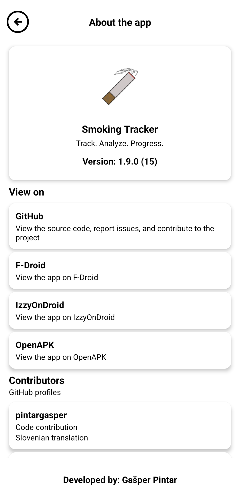

<div align="center">


<br>
<h1>Smoking Tracker</h1>

<p align="center">
  <a href="README.md">English</a> | <a href="README.sl.md">Slovenščina</a> 
</p>

</div>

<div align="center">

Ustvaril [Gašper Pintar](https://gasperpintar.com)

[](https://gasperpintar.com/smoking-tracker)

<div style="display:flex; justify-content:center; align-items:center; gap:2px;">
  <a href="https://github.com/pintargasper/SmokingTracker/releases/latest" target="_blank">
    
  </a>

  <a href="https://f-droid.org/en/packages/com.gasperpintar.smokingtracker/" target="_blank">
    
  </a>

  <a href="https://apt.izzysoft.de/fdroid/index/apk/com.gasperpintar.smokingtracker" target="_blank">
    
  </a>

  <a href="https://www.openapk.net/smoking-tracker/com.gasperpintar.smokingtracker/" target="_blank">
    
  </a>

  <a href="https://play.google.com/store/apps/details?id=com.gasperpintar.smokingtracker" target="_blank">
    
  </a>
</div>

[](https://apilevels.com)
[](https://github.com/pintargasper/SmokingTracker/releases)
[](https://github.com/pintargasper/SmokingTracker/releases)
[](https://apt.izzysoft.de/packages/com.gasperpintar.smokingtracker)
[](https://github.com/pintargasper/SmokingTracker/stargazers)
[](https://github.com/pintargasper/SmokingTracker/blob/master/LICENSE)
[](https://translate.gasperpintar.com/engage/smokingtracker/)

[](https://github.com/pintargasper/SmokingTracker/actions/workflows/build.yml)
[](https://github.com/pintargasper/SmokingTracker/actions/workflows/fastlane.yml)
[](https://github.com/pintargasper/SmokingTracker/actions/workflows/sync-bots.yml)
</div>

Na voljo tudi na
 - [Android
   Freeware](https://www.androidfreeware.net/download-smoking-tracker-apk.html)

## Kazalo vsebine
- [O aplikaciji](#-about)
- [Podprti jeziki](#-supported-languages)
- [Pomagajte pri prevajanju](#-help-translate)
- [Odvisnosti in različice](#-dependencies--versions)
- [Navodila za gradnjo](#-building-instructions)

## 🚀 O aplikaciji
**Sledilnik Kajenja** je enostavna aplikacija za sledenje kajenju, ki vam pomaga
razumeti vaše navade in napredek pri opuščanju kajenja. Vsaka cigareta, ki jo
pokadite, je jasno zabeležena, kar vam daje podroben vpogled v vaše dnevne,
tedenske in mesečne vzorce

### Ključne značilnosti
- *Sledenje zgodovini kajenja*
- *Dnevna, tedenska, mesečna in letna statistika*
- *Analiza porabe*
- *Napovedovanje kajenja*
- *Sledenje času brez kajenja*
- *Sledenje finančnemu vplivu in stroškom*
- *Opombe*
- *Lokalna hramba podatkov*
- *Podpora za varnostno kopiranje Androida* (nastavitve naprave)
- *Podpora za več jezikov*

### Slike aplikacije
<details>
  <summary>View application images</summary>

  <div align="center">
    
    
    
    
    
    
    
    
    
    
    
    
  </div>
</details>

## 🌐 Pomagajte pri prevajanju

<div align="center">
  <a href="https://translate.gasperpintar.com/engage/smokingtracker/">
    
  </a>
</div>

## 📝 Odvisnosti in različice

**Vtičnik za Gradle**
- Vtičnik Android Gradle: 9.4.1

**Knjižnice**
> Vse knjižnice so konfigurirane v
> [`libs.versions.toml`](gradle/libs.versions.toml)

## 🛠️ Navodila za izdelavo

### Navodila za gradnjo

1. **Kloniraj repozitorij**
```shell
git clone https://github.com/pintargasper/SmokingTracker.git
cd SmokingTracker
```

2. **Odprite projekt v Android Studiu**
- Izberite **Uvozi projekt (Gradle)** in počakajte, da se projekt sinhronizira
- Prepričajte se, da imate nastavljeno pravilno različico **JDK** in **Android
  SDK**

3. **Zgradite APK ali zaženite aplikacijo**
- Za različico za razhroščevanje
```shell
./gradlew assembleDebug
```
- Za končno različico
```shell
./gradlew assembleRelease
```

4. **Zaženi na emulatorju ali napravi**
- V programu Android Studio izberite emulator ali priključite fizično napravo in
  kliknite **Zaženi**
